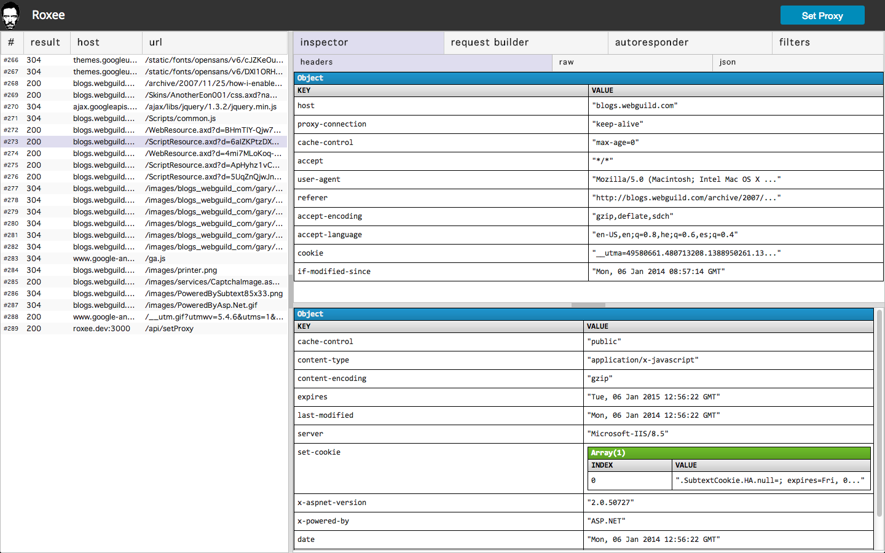
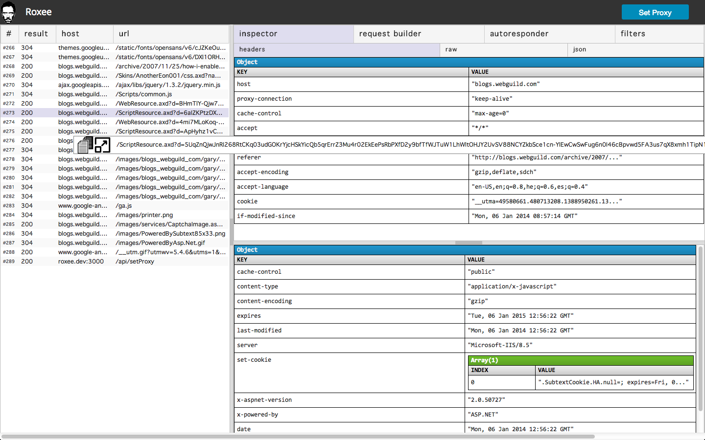

- what I wanted to accomplish
- why
- tech stack (mimosa, nodejs, c++, express, node-http-proxy - thx nodejitsu, coffeescript, sass, jade)
- what mimosa does
- what node does
- what c++
- capture requests... show bottom autoscroll...

